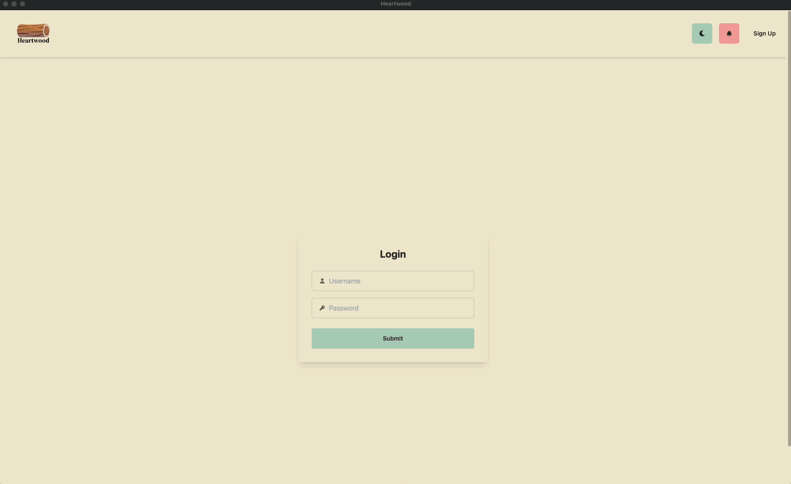
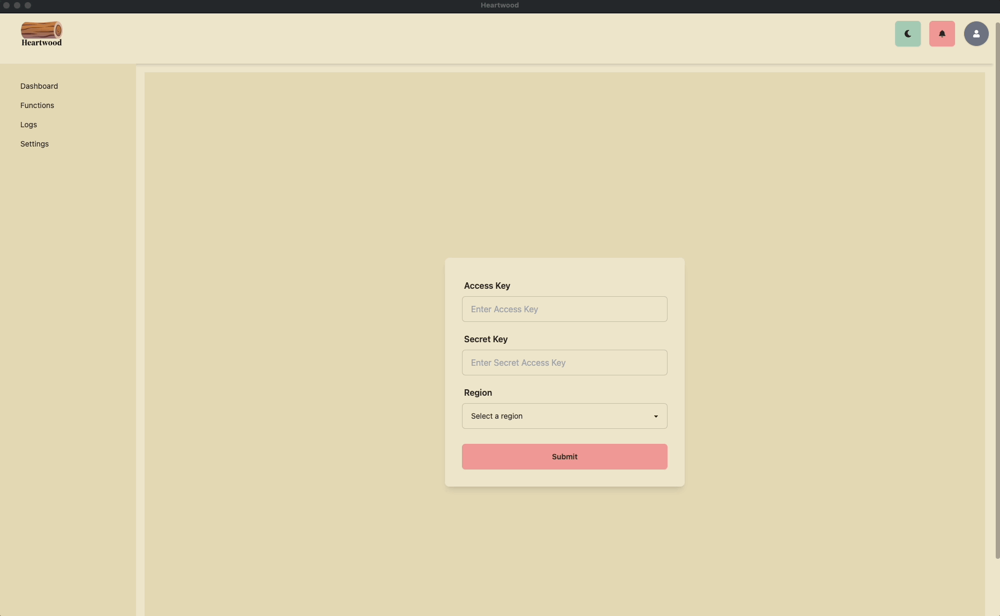
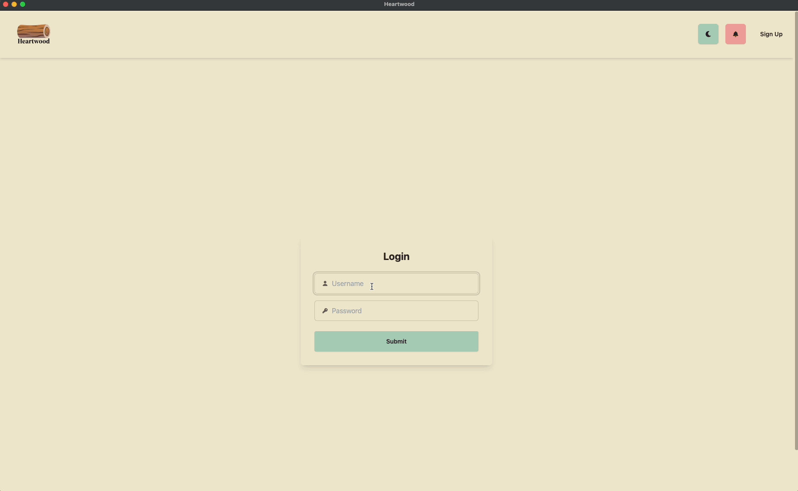
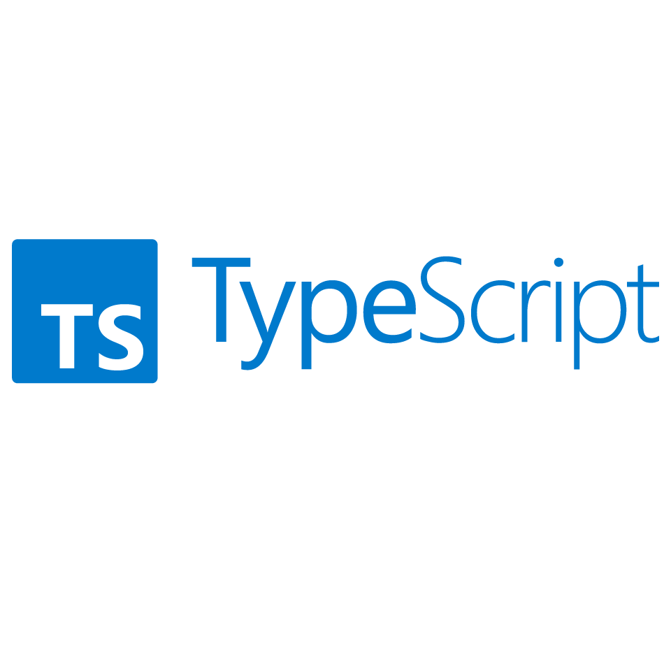

<h1 align="center">
     
    
     
    AWS Lambda Logs & Metrics Monitoring Tool
     
</h1>

## Table of Contents

- [About Heartwood](#about-heartwood)
- [Features](#features)
- [Getting Started](#getting-started)
    - [Prerequisites](#prerequisites)
    - [Installation](#installation)
- [User Guide](#user-guide)
- [Technology Stack](#technology-stack)
- [Roadmap](#roadmap)
- [Contributing](#contributing)
- [License](#license)
- [Our Team](#our-team)

---

## About Heartwood

We can trace back to the emergence of server-less cloud computing to years between 2006 and 2010 with Amazon deliverance of its S3 and EC2 instance. This ultimately changed the way services could be architected. Fast forward to 2014 and we now have the emergence of (FaaS) Function as a service. Specifically AWS Lambda, this revolutionized server management for any small to large enterprise. With AWS Lambda as the forefront of (FaaS) Function as a service. Developers or businesses are able to effectively reduced their costs and execute events without having the costly implications of having a physical server. As a result, businesses can quickly scale their demanding needs without having to sacrifice much server infrastructure along the way.

Being the forefront runner in the cloud computing space. We know how important AWS Lambda is to the many developers around the world, and we realized how noticably difficult it can be tracking functions can be. Here is where Heartwood plays in. We designed Heartwood, a desktop application monitoring service through a developer's perspective. This application enables developers and engineers the ease of access and and viewing to their function's respective metrics, knowing how our function is running with specific details such as invocation, error counts and simplified log viewing. Heartwood is aimed to provide inituative viewing experience for your lambda functions. 

**Heartwood** is a GUI application designed to help Cloud Engineers and DevOps teams monitor their AWS Lambda functions. With this tool, users can visualize real-time metrics, logs, and costs associated with their Lambda functions, enabling enhanced performance optimization and cost management.

## Features

- **Real-Time Metrics Dashboard**: Display key performance metrics for selected Lambda functions, including:
    - Invocation count
    - Execution duration
    - Memory usage
    - Error rates
    - Throttles

- **AWS Lambda Function Integration**: Enable users to connect their AWS accounts and view all Lambda functions in one place.

- **Live Log Stream Monitoring**: Observe and analyze log streams for each function, with logs updating in near real-time as new entries are generated during testing.

## Getting Started

### Prerequisites

To use this project, ensure you have the following set up:

- AWS Account: A valid AWS account with access to AWS Lambda and CloudWatch services.
- IAM User: Create or use an IAM user with the following permissions (as shown in the screenshot):
  - AWSLambda_ReadOnlyAccess: Provides read-only access to AWS Lambda.
  - CloudWatchLogsReadOnlyAccess: Allows read-only access to CloudWatch Logs.
  - CloudWatchReadOnlyAccess: Allows read-only access to CloudWatch.
- Access Keys: Obtain the access key and secret access key for your IAM user. These are necessary to authenticate with AWS services.
- Register AWS Credentials:
  - After signing up or logging in to the application, navigate to the settings page.
  - Register your IAM user’s AWS credentials (access key and secret access key) and specify the AWS region.

 ### Installation
 - To be updated: This section is currently a work in progress and will be updated soon.

## User Guide
### Registration
-  Create an account for Heartwood by entering your information and then register your AWS credentials within the Settings page.

  

### Lambda Functions Overview
- Head over to the functions page after entering your AWS credentials to view all the functions available for the AWS user. 

  

### Metrics Dashboard
- On the dashboard, you can explore detailed metrics for your AWS Lambda functions with flexible filtering options by time period and date range. Key metrics displayed include invocation count, error rate, throttle events, and execution duration, providing a comprehensive view of your function’s performance and activity. 

  

### Live Logs Streaming
- On the logs page, you can view real-time log streams for each AWS Lambda function, with options to filter by All logs/Reports and search for specific logs. This allows you to monitor function activity as it happens, troubleshoot issues, and gain insights into performance directly from live logs.

  

 ## Technology Stack
 
 

 
 

 
 

 
 

## Roadmap

The Heartwood project is continuously evolving, with plans to add new features, enhance functionality, and expand integration capabilities. Our goal is to build a robust AWS Lambda monitoring tool that offers real-time insights, in-depth analytics, and seamless integrations. Below are some of the new features and improvements we aim to implement in future releases. Contributions and suggestions from the community are always welcome to help shape Heartwood’s development!

- **In-App Notification System for Errors**: Develop a real-time notification system to alert users of errors and performance issues directly within the application interface.
- **Enhanced Analytics**: Incorporate more detailed analytics, including cost breakdowns, cold start tracking, and invocation trends.
- **Personalized user settings and preferences**: Allow users to customize their user settings and preferences in the settings page. 

## Contributing

Heartwood is an open-source product supported by tech accelerator OS Labs and we welcome contributions from the community! Here’s how to get started:

1. **Fork the Repository**: Start by forking the repository to make your own copy.

2. **Set up your dev environment**: Clone your forked repository to your local machine and install any necessary dependencies as outlined in the [Getting Started](#getting-started) section.

3. **Create a Branch**: For new features or bug fixes, create a branch with a descriptive name such as "johndoe-newfeature1" or "janedoe-bugfix2". This will allow you to make new changes without affecting the main branch of the repository.

4. **Make your changes**: Implement your feature or bug fix. Please follow the project’s coding standards and make sure your code is well-documented and tested.

5. **Commit and push your changes**: Write clear, concise commit messages that describe your changes. Push your branch to your forked repository on GitHub.

6. **Open a pull request**: Navigate to the original Heartwood repository and open a pull request (PR) from your branch. Provide a detailed description of your changes, including the motivation for the update, any relevant context, and any tests you've included.

Once your pull request is submitted, the project maintainers will review it, provide feedback if necessary, and approve it for merging when ready. Thank you for contributing to Heartwood! 

## License 
This project is distributed under the MIT License. See the `LICENSE` file for more information.

## Our Team
  <table>
  <tr>
    <td align="center">
      
       
      <b>Justin Tran</b>
       
      <a href="https://www.linkedin.com/in/justin-tran-199499186/">LinkedIn</a>
      <a href="https://github.com/justinvtran">GitHub</a>
    </td>
    <td align="center">
      
       
      <b>Shun Ito</b>
       
      <a href="https://www.linkedin.com/in/shun-ito-89467152/">LinkedIn</a>
      <a href="https://github.com/shundayo131">GitHub</a>
    </td>
    <td align="center">
      
       
      <b>Yoshimi Araki</b>
       
      <a href="https://www.linkedin.com/in/yoshimi-araki-577884153/">LinkedIn</a>
      <a href="https://github.com/YoshiA443">GitHub</a>
    </td>
     <td align="center">
      
       
      <b>Jackie Lau</b>
       
      <a href="https://www.linkedin.com/in/jackielauu/">LinkedIn</a>
      <a href="https://github.com/Laujacke">GitHub</a>
    </td>
    <td align="center">
      
       
      <b>Daniel Koch</b>
       
      <a href="https://www.linkedin.com/in/daniel-koch-9a9a6bb0/">LinkedIn</a>
      <a href="https://github.com/OrigamiSalami">GitHub</a>
    </td>
  <tr>
 
  </tr>
</table>
